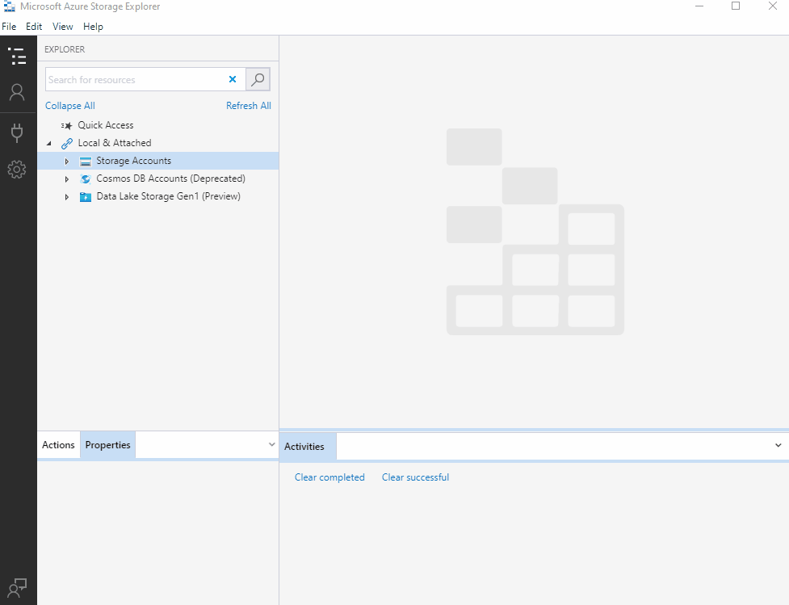

# Data Management

OpenPAI Marketplace uses [Azuere Blob Storage](https://docs.microsoft.com/en-us/azure/storage/blobs/) as data storage system. In marketplace, we use Azure Storage Explorer as data management tool for both upload and download, and pai-copy tool is an CLI utility to help user upload data in "OUTPUT_DIR" environ to Azure Blob Storage.

## Data Management by Azure Storage Explorer

As prerequisites, you need download and install [Azure Storage Explorer](https://azure.microsoft.com/en-us/features/storage-explorer/) at first.

Azure Storage Explorer use various ways to verify if you're authorized to access. In OpenPAI Marketplace, we suggest you using connection string. You can get your  connection string by access: `https://<openpaimarketplace_rest_server_url>/storages/blobs?type=blob`. 
The api will reply a JSON string. The "connectionStrings" item is a list of connection string you can use to authorize Azure Storage Explorer access.


Following gif shows how to use connection string in Azure Storage Explorer to connect to your Azure Storage Service. The main steps are:

1. Click "Open Connet Dialog" button at sidebar.
2. Select "Use a connection string" option.
3. Paste your connection string. If there warns you any connection string error, you should go and see [SAS authentication tutorial](https://docs.microsoft.com/en-us/azure/active-directory/managed-identities-azure-resources/tutorial-linux-vm-access-storage-sas).
4. Trust and connect.



After connection established, you can browse, download and upload files. For detail usage, see [Azure Storage Explorer Documents](https://azure.microsoft.com/zh-cn/features/storage-explorer/). 


## Data Upload by pai-copy

[pai-copy](https://github.com/SwordFaith/pai-copy) is an CLI tool to help user uploda their data in OpenPAI jobs. It requires user define `OUTPUT_DIR` environ to store target directory or file path.

To use pai-copy tool, the code snippet are as following. The marketplace will automatically add this when create job from templates.

```bash
curl -sL https://deb.nodesource.com/setup_10.x -o nodesource_setup.sh
bash nodesource_setup.sh
apt update
apt install -y nodejs
npm config set @swordfaith:registry https://npm.pkg.github.com/
echo "//npm.pkg.github.com/:_authToken=<your_npm_install_token>" >> ~/.npmrc
npm install -g @swordfaith/pai_copy
export STORAGE_CONNECTION_STRING="<your_connection_string>"

<your_code_here>

# pai_copy upload [filePath] [containerName] [blobFolder]
if [ -z ${OUTPUT_DIR+x}]; then
  echo "Not found OUTPUT_DIR environ"
else
  pai_copy upload ${OUTPUT_DIR} <your_container> ${PAI_USER_NAME}/${PAI_JOB_NAME}/
fi
```
